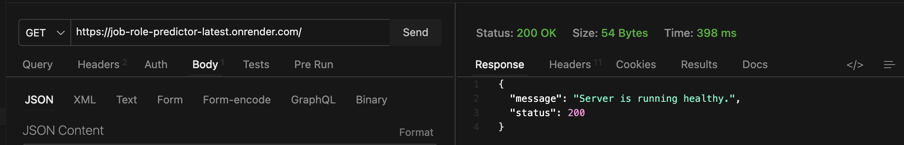
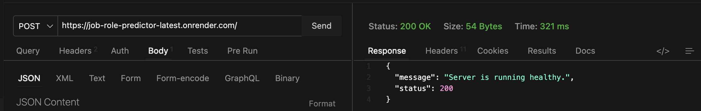
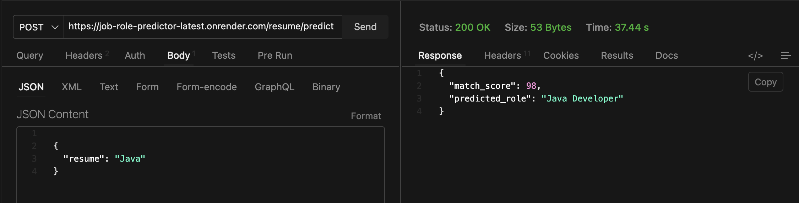

# Job Role Predictor 

- Live Url : [https://job-role-predictor-latest.onrender.com]
- Description : A backend service to predict the ideal job roles based on the resume content.
- Tech Stack : 
    - Flask (Backend Service)
    - Kaggle (Dataset source)
    - pyTorch and scikit learn (data preprocessing and Model training )
    - docker  (Containerization)
    - Github Actions (CI/CD)
    - Postman & thunder client (Api testing)
    - Docker Hub (image registry)
    - Render (deployment)
- It is machine learning based job role predictor.
- It has complete DevOps pipeline :  `Data Collection` &rarr; `Data Preprocessing` &rarr; `code & model Training` &rarr; `Testing` &rarr; `Containerization` &rarr; `CI/CD` &rarr; `push to docker Hub` &rarr; `deployment on render` 

### Active Endpoints
- /GET `/` - index route (health check)

- /POST `/` - index route (health check)

- /POST `/resume/predictor` - main route (Job role prediction)


### Architecture
```
resume Content (input)
      |
Endpoint(app.py) [/POST]
      |
Extract resume content 
      |
Use trained Model to make prediction
      |
Return Output 
    {
        score ,
        predicted job role
    }
```

*Dataset Used :*
- Update resume dataset  &nbsp; [https://www.kaggle.com/datasets/jillanisofttech/updated-resume-dataset]
- Dataset Feild : ["role","resume"]

*ML model used :*
- Logistic Regression
- For multi-class classification


